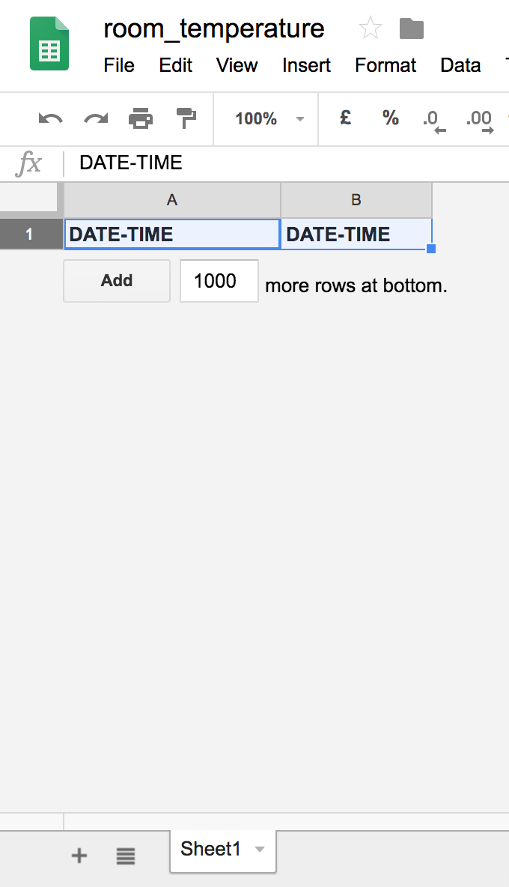
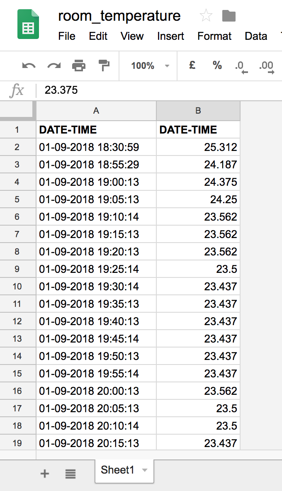

# pylogger
Simple Logger using sensor DS18B20 and a Raspberry py

In this project a Raspberry pi is used to measure room temperature and store the value on a Google spreadsheet.

The code for getting the temperature handling the sensor DS18B20 is taken [here](http://www.circuitbasics.com/raspberry-pi-ds18b20-temperature-sensor-tutorial/).

## Additional notes

### Libraries

The code id based on python 3 and makes use of these additional libraries: [gspread](https://github.com/burnash/gspread) and [oauth2client](https://github.com/google/oauth2client)

### Using OAuth2 for Authorization

To handle google credentials in Python you can refer to [this](https://gspread.readthedocs.io/en/latest/oauth2.html) explanation.

### How to schedule the code

Ipm running the code on a Raspberry pi that use raspbian. Hence, I schedure the job by means of `crontab`. Currently the temperature is registered every 5 minutes using the following setting:

`*/5 * * * *   <path_to_python_interpreter>   <path_to_project/pyloger.py>`

### Further tip

Google spreadsheet, by default, are created with 1000 empty rows. You must delete them all because `pylogger.py` appends new data at the end of the specified google spreadsheet creating a new row.

Bellow, my initialized google spreadsheet (left) with only one row with labels, and the same sheet after some time during the execution of the code.

&nbsp;&nbsp;&nbsp;&nbsp;&nbsp;&nbsp;&nbsp;&nbsp;&nbsp;&nbsp;&nbsp;&nbsp;

